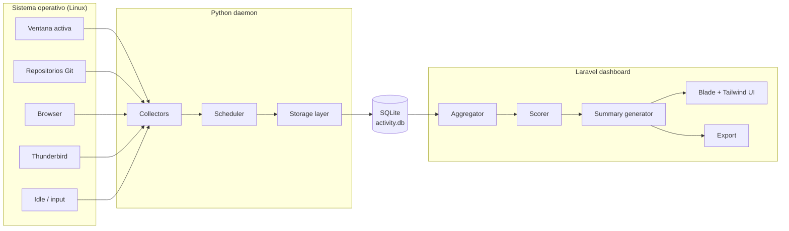

# trackActivity

Aplicación personal de productividad enfocada en la **reconstrucción automática de la actividad laboral** para facilitar el reporte posterior en sistemas de timesheet.

> Uso personal · Offline-first · Privacidad por diseño · Sin dependencias en la nube

---

## ¿Qué problema resuelve?

Cuando trabajas a diario sobre múltiples proyectos de software, registrar el tiempo en el timesheet días o semanas después se vuelve un ejercicio de arqueología: revisar commits de Git, hilos de correo, historial del navegador, ramas activas, conversaciones de GitHub...

`trackActivity` automatiza esa reconstrucción. Captura **señales ligeras** de tu actividad en segundo plano, las agrupa en bloques de tiempo y deduce el **proyecto dominante** en cada bloque, ofreciendo un timeline limpio listo para reportar.

> **Importante:** la aplicación **no mide tiempos exactos por ventana**. Funciona como un *sistema de reconstrucción de contexto de trabajo*.

---

## Stack tecnológico

| Componente | Tecnología |
|------------|------------|
| Captura de actividad (daemon) | Python 3.11+ |
| Almacenamiento | SQLite |
| Dashboard / UI | Laravel 11 + Blade + TailwindCSS |
| Admin (opcional) | Filament |
| SO objetivo | Linux (Ubuntu 22.04+) |

---

## Arquitectura en un vistazo



Ver detalle en [`docs/02-architecture.md`](docs/02-architecture.md).

---

## Documentación

La documentación está organizada modularmente en [`/docs`](docs):

| # | Documento | Contenido |
|---|-----------|-----------|
| 01 | [Overview](docs/01-overview.md) | Problema, filosofía, glosario |
| 02 | [Arquitectura](docs/02-architecture.md) | Componentes, flujo de datos |
| 03 | [Instalación](docs/03-installation.md) | Setup en Ubuntu, systemd |
| 04 | [Configuración](docs/04-configuration.md) | Daemon, mappings, `.env` |
| 05 | [Esquema BBDD](docs/05-database-schema.md) | Tablas, índices, ER |
| 06 | [Daemon Python](docs/06-python-daemon.md) | Collectors, scheduler |
| 07 | [Dashboard Laravel](docs/07-laravel-dashboard.md) | Rutas, modelos, vistas |
| 08 | [Señales de actividad](docs/08-activity-signals.md) | Tipos y formato |
| 09 | [Context scoring](docs/09-context-scoring.md) | Algoritmo de pesos |
| 10 | [Bloques de tiempo](docs/10-time-blocks.md) | Agregación 15-min |
| 11 | [Generación de resúmenes](docs/11-summary-generation.md) | Plantillas y tono |
| 12 | [Exportación](docs/12-export-system.md) | TXT / Markdown / CSV |
| 13 | [Guía de desarrollo](docs/13-development-guide.md) | Setup, convenciones |
| 14 | [Roadmap MVP](docs/14-mvp-roadmap.md) | Alcance v1 |

---

## Quick start (resumen)

```bash
# 1. Clonar
git clone <repo> trackActivity && cd trackActivity

# 2. Daemon Python
cd tracker
python3 -m venv .venv && source .venv/bin/activate
pip install -r requirements.txt
cp config.example.yml config.yml
python -m tracker.cli init-db
python -m tracker.cli run

# 3. Dashboard Laravel
cd ../dashboard
composer install
cp .env.example .env
php artisan key:generate
php artisan migrate
php artisan serve
```

Detalle completo en [`docs/03-installation.md`](docs/03-installation.md).

---

## Principios de diseño

1. **Offline-first.** No requiere conexión a internet para funcionar.
2. **Privacidad total.** Toda la información se queda en disco local. No hay telemetría ni sincronización en nube.
3. **Bajo impacto.** El daemon debe ser ligero: poca CPU, pocas escrituras a disco, sin spikes.
4. **Reconstrucción, no vigilancia.** No mide tiempo exacto por ventana; agrupa señales para inferir contexto.
5. **Corregible.** El usuario siempre puede ajustar manualmente bloques, proyectos y resúmenes.

---

## Estado actual

Repositorio en fase de **documentación previa al desarrollo**. Ver [`docs/14-mvp-roadmap.md`](docs/14-mvp-roadmap.md) para el alcance de la v1.

---

## Licencia

Ver [`LICENSE`](LICENSE).
