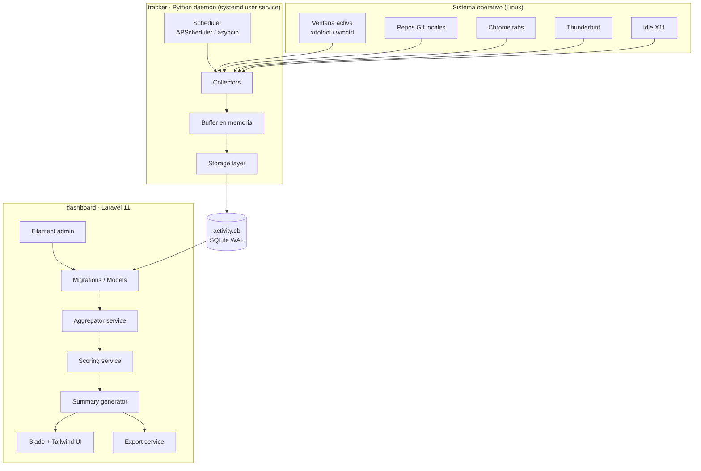
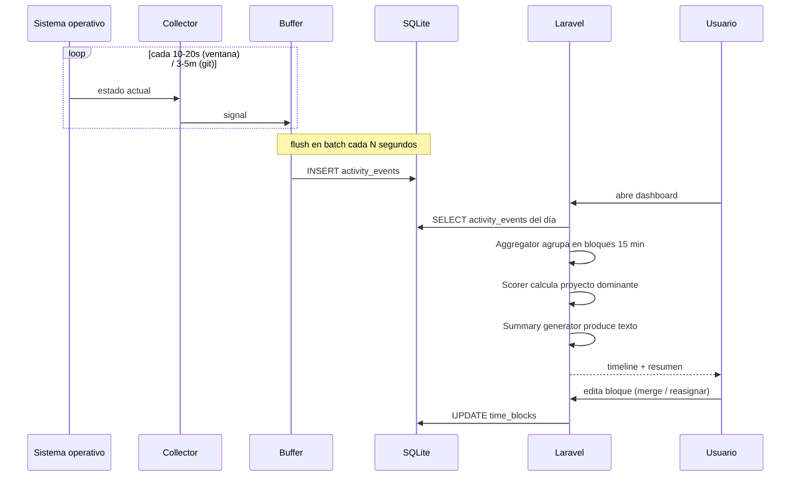

# 02 · Arquitectura

## Visión general

`trackActivity` está compuesto por **dos procesos independientes** que se comunican a través de una **base de datos SQLite compartida**:

1. **Tracker (Python daemon)** — captura señales del sistema operativo y las persiste.
2. **Dashboard (Laravel)** — lee la base de datos, agrega, puntúa, resume y presenta.

Esta separación es deliberada: cada lado puede ejecutarse, reiniciarse o desarrollarse de forma aislada. El daemon nunca depende del dashboard, y el dashboard funciona aunque el daemon esté detenido (mostrará datos hasta el último evento capturado).



## Componentes

### 1. Tracker (Python)

Daemon que se ejecuta como **servicio de usuario de systemd**. Su único trabajo es capturar señales y persistirlas.

- **Scheduler**: orquesta la ejecución periódica de cada collector (intervalos configurables).
- **Collectors**: módulos especializados, cada uno con responsabilidad única (ventana activa, repos Git, browser, idle, email). Ver [`06-python-daemon.md`](06-python-daemon.md).
- **Buffer en memoria**: acumula señales y las descarga en batch a SQLite para minimizar escrituras.
- **Storage layer**: capa fina sobre `sqlite3` o `SQLAlchemy Core` que respeta el esquema.

### 2. Base de datos (SQLite)

Único punto de contacto entre daemon y dashboard. Ver esquema en [`05-database-schema.md`](05-database-schema.md).

- Modo **WAL** (Write-Ahead Logging) habilitado: permite lectura concurrente desde Laravel mientras el daemon escribe.
- Ubicación por defecto: `~/.local/share/trackActivity/activity.db`.
- Migraciones gestionadas desde **Laravel** (`php artisan migrate`). El daemon Python sólo lee/escribe; no altera el esquema.

> Decisión: las migraciones viven en Laravel porque el modelo es más cómodo allí y porque Filament necesita las tablas declaradas como modelos Eloquent. El daemon trata el esquema como contrato.

### 3. Dashboard (Laravel)

Aplicación web local con:

- **Migrations / Models**: definición del esquema y modelos Eloquent.
- **Aggregator service**: agrupa señales por bloque de tiempo. Ver [`10-time-blocks.md`](10-time-blocks.md).
- **Scoring service**: aplica pesos y determina proyecto dominante por bloque. Ver [`09-context-scoring.md`](09-context-scoring.md).
- **Summary generator**: produce texto humano a partir de evidencia. Ver [`11-summary-generation.md`](11-summary-generation.md).
- **UI (Blade + Tailwind)**: timeline diario/semanal, calendario, filtros, edición manual.
- **Filament admin (opcional)**: edición rápida de mappings, proyectos y bloques.
- **Export service**: TXT / Markdown / CSV. Ver [`12-export-system.md`](12-export-system.md).

## Flujo de datos end-to-end



## Decisiones de diseño

### Dos procesos en lugar de uno

- El tracker debe ser ultraligero y muy estable. Embeber un servidor PHP dentro le añadiría carga y superficie de fallo.
- Laravel ofrece un ecosistema mucho más cómodo para UI, formularios, migraciones y exports.
- SQLite hace de "cola" naturalmente: el daemon empuja, el dashboard consume.

### SQLite (no PostgreSQL/MySQL)

- Zero-setup: un solo archivo.
- Cumple privacidad por diseño (todo en disco local).
- Suficiente para el volumen esperado (~5k–20k eventos por día por usuario).
- Modo WAL elimina el problema de bloqueos lector/escritor.

### Sin colas ni brokers

No hay RabbitMQ, Redis ni similares. El flujo es:

```
collector -> buffer -> SQLite -> Laravel
```

Esta simplicidad es intencional: el sistema debe poder reiniciarse, debuggearse y respaldarse copiando un único archivo.

### Scoring en Laravel (no en el daemon)

El daemon **solo captura señales crudas**. El scoring y la agregación se hacen en Laravel, en lectura.

Ventajas:

- El daemon no necesita conocer la configuración de scoring; permanece estúpido y estable.
- Reajustar pesos no requiere reiniciar el daemon ni reprocesar nada: la siguiente carga del dashboard refleja los nuevos pesos.
- Permite "re-scoring histórico" cambiando una regla y viendo cómo cambia el pasado.

### Mutación de eventos

Los `activity_events` son **inmutables**. Solo `time_blocks` y `generated_summaries` se editan (por el usuario o regenerados por el sistema). Esto preserva la verdad observada.

## Capas y responsabilidades

| Capa | Responsabilidad | Lenguaje |
|------|-----------------|----------|
| Captura | Observar el SO. Sin lógica de negocio. | Python |
| Persistencia | Escribir señales en batch. | Python (write) / Laravel (read & schema) |
| Agregación | Agrupar señales por ventana de tiempo. | PHP |
| Scoring | Calcular proyecto dominante y confianza. | PHP |
| Síntesis | Generar resumen humano. | PHP |
| Presentación | Mostrar y permitir corrección. | PHP + Blade + Tailwind |
| Export | Exportar a formatos planos. | PHP |

## Estructura de directorios del repo

```
trackActivity/
├── README.md
├── LICENSE
├── docs/                  # Esta documentación
│   ├── 01-overview.md
│   ├── 02-architecture.md
│   └── ...
├── tracker/               # Daemon Python
│   ├── README.md
│   ├── pyproject.toml
│   ├── requirements.txt
│   ├── config.example.yml
│   └── src/tracker/
│       ├── __init__.py
│       ├── cli.py
│       ├── scheduler.py
│       ├── storage.py
│       ├── collectors/
│       │   ├── window.py
│       │   ├── git.py
│       │   ├── browser.py
│       │   ├── thunderbird.py
│       │   └── idle.py
│       └── utils/
└── dashboard/             # App Laravel
    ├── README.md
    ├── composer.json
    ├── .env.example
    ├── app/
    │   ├── Models/
    │   ├── Services/
    │   │   ├── Aggregator.php
    │   │   ├── Scorer.php
    │   │   ├── SummaryGenerator.php
    │   │   └── Exporter.php
    │   ├── Http/Controllers/
    │   └── Filament/
    ├── database/migrations/
    └── resources/views/
```

## Despliegue

Ambos componentes corren en la **misma máquina** del usuario. No se contempla despliegue distribuido.

- Daemon: `systemd --user` (ver [`03-installation.md`](03-installation.md)).
- Dashboard: `php artisan serve` o servidor local (nginx + php-fpm) en `127.0.0.1`.

## Lo que NO está en la arquitectura

- ❌ Sin servidor remoto.
- ❌ Sin autenticación (uso personal, una sola sesión).
- ❌ Sin multi-usuario.
- ❌ Sin cola de mensajes.
- ❌ Sin cache distribuido.
- ❌ Sin contenedores requeridos (Docker es opcional para desarrollo).
