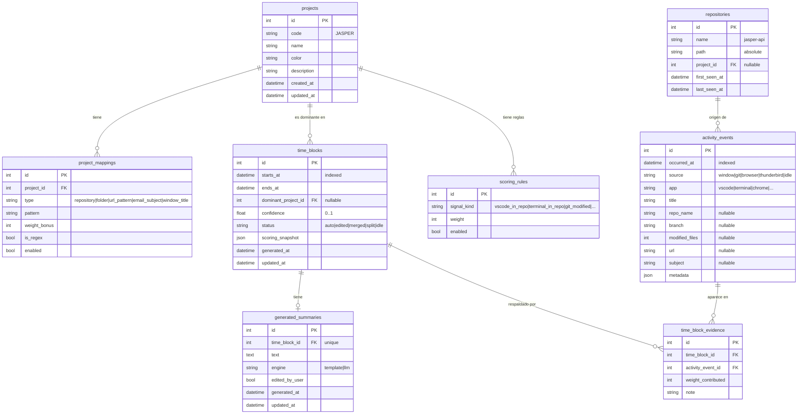

# 05 · Esquema de base de datos

SQLite, archivo único en `~/.local/share/trackActivity/activity.db`. Modo **WAL** obligatorio para permitir lectura concurrente desde Laravel mientras el daemon escribe.

Las migraciones se gestionan desde Laravel (`database/migrations`). El daemon Python solo lee/escribe; **nunca modifica esquema**.

---

## Diagrama entidad-relación



---

## Tablas

### `projects`

Catálogo de proyectos lógicos del usuario.

| Columna | Tipo | Restricciones | Descripción |
|---------|------|--------------|-------------|
| `id` | INTEGER | PK, autoincrement | |
| `code` | TEXT | NOT NULL, UNIQUE | Código corto: `JASPER`, `YWL`, `TDS`. |
| `name` | TEXT | NOT NULL | Nombre legible. |
| `color` | TEXT | NULL | Hex color para UI (ej. `#10b981`). |
| `description` | TEXT | NULL | |
| `created_at` | DATETIME | NOT NULL | |
| `updated_at` | DATETIME | NOT NULL | |

Índices: `UNIQUE(code)`.

---

### `repositories`

Repositorios Git detectados por el daemon en los `repositories_paths` configurados.

| Columna | Tipo | Restricciones | Descripción |
|---------|------|--------------|-------------|
| `id` | INTEGER | PK | |
| `name` | TEXT | NOT NULL | Nombre del directorio (`jasper-api`). |
| `path` | TEXT | NOT NULL, UNIQUE | Ruta absoluta. |
| `project_id` | INTEGER | FK → projects.id, NULL | Inferido desde mappings; editable. |
| `first_seen_at` | DATETIME | NOT NULL | |
| `last_seen_at` | DATETIME | NOT NULL | Actualizado en cada scan. |

Índices: `UNIQUE(path)`, `INDEX(name)`.

> El daemon hace **upsert** por `path`. El binding a `project_id` lo resuelve Laravel vía mappings.

---

### `project_mappings`

Reglas que asocian artefactos del SO a proyectos.

| Columna | Tipo | Restricciones | Descripción |
|---------|------|--------------|-------------|
| `id` | INTEGER | PK | |
| `project_id` | INTEGER | FK → projects.id, NOT NULL | |
| `type` | TEXT | NOT NULL, CHECK | Uno de: `repository`, `folder`, `url_pattern`, `email_subject`, `window_title`. |
| `pattern` | TEXT | NOT NULL | Substring o regex. |
| `is_regex` | BOOLEAN | NOT NULL DEFAULT false | Si `true`, `pattern` se compila como regex (POSIX/PHP). |
| `weight_bonus` | INTEGER | NOT NULL DEFAULT 0 | Bonus adicional al peso base de la señal. |
| `enabled` | BOOLEAN | NOT NULL DEFAULT true | |
| `created_at` | DATETIME | NOT NULL | |
| `updated_at` | DATETIME | NOT NULL | |

Índices: `INDEX(type, enabled)`, `INDEX(project_id)`.

---

### `scoring_rules`

Pesos base por tipo de señal. Editables sin reiniciar el daemon (los lee Laravel al puntuar).

| Columna | Tipo | Restricciones | Descripción |
|---------|------|--------------|-------------|
| `id` | INTEGER | PK | |
| `signal_kind` | TEXT | NOT NULL, UNIQUE | Identificador de la señal: `vscode_in_repo`, `terminal_in_repo`, `git_modified`, `url_match`, `email_match`, `window_title_match`. |
| `weight` | INTEGER | NOT NULL | Peso base. |
| `enabled` | BOOLEAN | NOT NULL DEFAULT true | |
| `description` | TEXT | NULL | |

Seed inicial sugerido en [`09-context-scoring.md`](09-context-scoring.md).

---

### `activity_events`

Señales crudas escritas por el daemon. **Inmutables.**

| Columna | Tipo | Restricciones | Descripción |
|---------|------|--------------|-------------|
| `id` | INTEGER | PK | |
| `occurred_at` | DATETIME | NOT NULL, INDEX | Momento de captura. UTC. |
| `source` | TEXT | NOT NULL, CHECK | `window`, `git`, `browser`, `thunderbird`, `idle`. |
| `app` | TEXT | NULL | Ej.: `code`, `gnome-terminal`, `chrome`. |
| `title` | TEXT | NULL | Título de la ventana. |
| `repo_name` | TEXT | NULL | Solo cuando `source = git` o la ventana está dentro de un repo. |
| `branch` | TEXT | NULL | |
| `modified_files` | INTEGER | NULL | |
| `url` | TEXT | NULL | Solo `source = browser`. |
| `subject` | TEXT | NULL | Solo `source = thunderbird`. |
| `metadata` | JSON | NULL | Campo libre para datos adicionales por collector. |

Índices: `INDEX(occurred_at)`, `INDEX(source, occurred_at)`, `INDEX(repo_name)`.

> **Política de retención**: ver sección al final.

---

### `time_blocks`

Bloques temporales reconstruidos (por defecto de 15 min).

| Columna | Tipo | Restricciones | Descripción |
|---------|------|--------------|-------------|
| `id` | INTEGER | PK | |
| `starts_at` | DATETIME | NOT NULL, INDEX | Inicio alineado al grid (00, 15, 30, 45). UTC. |
| `ends_at` | DATETIME | NOT NULL | |
| `dominant_project_id` | INTEGER | FK → projects.id, NULL | NULL si el bloque es `idle` o sin señales suficientes. |
| `confidence` | REAL | NULL | 0.0–1.0. |
| `status` | TEXT | NOT NULL, CHECK | `auto`, `edited`, `merged`, `split`, `idle`. |
| `scoring_snapshot` | JSON | NULL | Top-N proyectos puntuados, para auditoría. |
| `generated_at` | DATETIME | NOT NULL | |
| `updated_at` | DATETIME | NOT NULL | |

Índices: `UNIQUE(starts_at)`, `INDEX(dominant_project_id)`.

Estados:

- `auto`: generado automáticamente.
- `edited`: el usuario cambió el proyecto o el resumen.
- `merged`: resultado de fusionar varios bloques contiguos.
- `split`: bloque dividido manualmente (se crean N nuevos `time_blocks`).
- `idle`: usuario inactivo durante el bloque.

---

### `time_block_evidence`

Trazabilidad: qué eventos respaldan cada bloque.

| Columna | Tipo | Restricciones | Descripción |
|---------|------|--------------|-------------|
| `id` | INTEGER | PK | |
| `time_block_id` | INTEGER | FK → time_blocks.id, NOT NULL, ON DELETE CASCADE | |
| `activity_event_id` | INTEGER | FK → activity_events.id, NOT NULL | |
| `weight_contributed` | INTEGER | NOT NULL | Peso real aportado por este evento al proyecto dominante. |
| `note` | TEXT | NULL | Anotación libre (regla aplicada, mapping matcheado, etc.). |

Índices: `INDEX(time_block_id)`, `INDEX(activity_event_id)`.

---

### `generated_summaries`

Texto humano por bloque. **Uno por bloque** (`time_block_id` único).

| Columna | Tipo | Restricciones | Descripción |
|---------|------|--------------|-------------|
| `id` | INTEGER | PK | |
| `time_block_id` | INTEGER | FK → time_blocks.id, NOT NULL, UNIQUE, ON DELETE CASCADE | |
| `text` | TEXT | NOT NULL | |
| `engine` | TEXT | NOT NULL | `template` (v1) o `llm` (futuro). |
| `edited_by_user` | BOOLEAN | NOT NULL DEFAULT false | Si `true`, no se regenera automáticamente. |
| `generated_at` | DATETIME | NOT NULL | |
| `updated_at` | DATETIME | NOT NULL | |

---

## PRAGMAs recomendados

Aplicar al abrir la conexión (ambos lados):

```sql
PRAGMA journal_mode = WAL;
PRAGMA synchronous = NORMAL;
PRAGMA foreign_keys = ON;
PRAGMA busy_timeout = 5000;
PRAGMA temp_store = MEMORY;
```

---

## Política de retención

Los `activity_events` crecen rápido (~5k–20k filas/día). Se recomienda:

| Capa | Retención |
|------|-----------|
| `activity_events` | 90 días (configurable) |
| `time_blocks` | indefinida |
| `time_block_evidence` | 90 días (sigue a `activity_events`) |
| `generated_summaries` | indefinida |

Job programado en Laravel:

```bash
php artisan tracker:prune-events --older-than="90 days"
```

Esto mantiene utilidad histórica (timeline + summaries) sin inflar la BBDD.

---

## Compatibilidad de schema

- **Source of truth**: migraciones de Laravel (`database/migrations/*.php`).
- El daemon Python debe declarar **explícitamente** los campos que escribe (en `tracker/storage.py`) y fallar de forma clara si encuentra un schema desconocido.
- Cualquier cambio de schema requiere bump de versión documentado en `docs/13-development-guide.md`.
