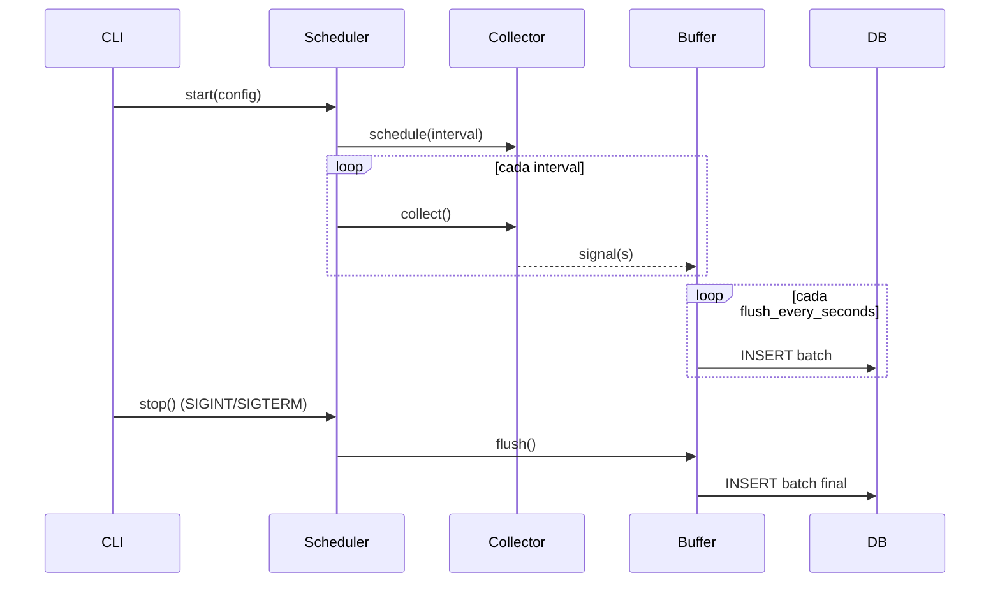

# 06 · Daemon Python (`tracker/`)

Componente que corre en segundo plano capturando señales del SO y persistiéndolas en SQLite.

> **Responsabilidad única**: observar y guardar. Sin scoring, sin agregación, sin lógica de negocio.

---

## Estructura propuesta

```
tracker/
├── README.md
├── pyproject.toml
├── requirements.txt
├── config.example.yml
├── scripts/
│   └── trackactivity.service       # unit file systemd
└── src/tracker/
    ├── __init__.py
    ├── cli.py                       # entrypoint CLI (typer/click)
    ├── config.py                    # carga y valida config.yml (pydantic)
    ├── scheduler.py                 # orquesta intervalos de los collectors
    ├── buffer.py                    # buffer en memoria + flush batch
    ├── storage.py                   # capa SQLite (sqlite3/SQLAlchemy Core)
    ├── models.py                    # dataclasses de señales
    ├── logging_setup.py
    ├── collectors/
    │   ├── __init__.py
    │   ├── base.py                  # clase abstracta Collector
    │   ├── window.py                # ventana activa
    │   ├── git.py                   # repos Git
    │   ├── browser.py               # tab de Chrome (opcional)
    │   ├── thunderbird.py           # asunto correo (opcional)
    │   └── idle.py                  # inactividad
    └── utils/
        ├── x11.py                   # wrappers xdotool/wmctrl
        ├── git_utils.py             # libgit2/pygit2 o subprocess
        └── paths.py                 # XDG paths
```

---

## Dependencias sugeridas

`requirements.txt`:

```
typer~=0.12
pydantic~=2.7
pydantic-settings~=2.3
APScheduler~=3.10
pyyaml~=6.0
pygit2~=1.15        # más eficiente que subprocess para git
python-xlib~=0.33   # detección de idle bajo X11
```

> Se evita SQLAlchemy ORM para mantener footprint bajo. `sqlite3` de la stdlib + SQL explícito es suficiente.

---

## Ciclo de vida



---

## CLI

Implementada con `typer`. Comandos:

| Comando | Descripción |
|---------|-------------|
| `tracker run` | Arranca el daemon (modo servicio). |
| `tracker run --foreground` | Igual, sin background, útil para debugging. |
| `tracker run --log-level=DEBUG` | Aumenta verbosidad. |
| `tracker doctor` | Verifica dependencias del SO (`xdotool`, permisos, BBDD, schema). |
| `tracker collect <kind> --once` | Ejecuta un único collector y muestra lo que captura sin escribir. |
| `tracker init-db` | (Opcional) crea la BBDD vacía con `PRAGMA journal_mode=WAL`. Las migraciones reales corren desde Laravel. |
| `tracker version` | |

Ejemplo: probar el collector de ventana sin persistir nada.

```bash
python -m tracker.cli collect window --once --dry-run
```

---

## Collectors

### Contrato base (`collectors/base.py`)

```python
from abc import ABC, abstractmethod
from typing import Iterable
from tracker.models import Signal

class Collector(ABC):
    name: str
    interval_seconds: int

    @abstractmethod
    def collect(self) -> Iterable[Signal]:
        """Devuelve 0..N señales capturadas en este tick."""
```

Cada collector implementa `collect()`. El `Scheduler` se encarga de invocarlo periódicamente y enrutar los `Signal` al `Buffer`.

### `window`

- Backend por defecto: `xdotool getactivewindow` + `xdotool getwindowname <wid>` para el título, y `xprop -id <wid> WM_CLASS` para la clase (xprop es más portable que `xdotool getwindowclassname`, que no existe en versiones antiguas de xdotool).
- Frecuencia recomendada: 10–20 s.
- Output:

```python
Signal(
    source="window",
    app="code",
    title="api.py — jasper-api - Visual Studio Code",
    repo_name="jasper-api",      # inferido si el proceso tiene cwd en un repo
    metadata={"wm_class": "code.Code"},
)
```

> **Optimización**: si el título y la app son idénticos al tick anterior, NO emitir un nuevo signal (deduplicación a nivel collector). Esto reduce notablemente el volumen.

### `git`

- Backend: `pygit2` o `subprocess` (`git status --porcelain`, `git rev-parse --abbrev-ref HEAD`).
- Frecuencia: 3–5 min.
- Recorre `collectors.git.repositories_paths` hasta `max_depth`, descubre `.git/` y captura por cada repo:

```python
Signal(
    source="git",
    repo_name="jasper-api",
    branch="fix/dashboard-permissions",
    modified_files=7,
    metadata={
        "latest_commit": {
            "hash": "a1b2c3d",
            "message": "Fix CRM access permissions",
            "ts": 1716100000,
        },
        "ahead": 2,
        "behind": 0,
    },
)
```

Además **actualiza la tabla `repositories`** (upsert por `path`).

### `browser` (opcional)

MVP: leer **solo el título de ventana de Chrome** que ya incluye el título de la tab activa.

Detección de URLs específicas (GitHub, Jira): regex sobre el título cuando el patrón es estable (`"... · Issue #123 · org/repo · GitHub - Google Chrome"`).

No requiere extensión de navegador. Si en el futuro se desea precisión, se podría añadir una extensión local que escriba a un socket local; queda fuera de MVP.

### `thunderbird` (opcional)

Mismo enfoque: el título de la ventana de Thunderbird suele incluir el asunto del correo abierto. Captura `subject` cuando se pueda parsear.

### `idle`

- Backend: `python-xlib` consultando `XScreenSaverQueryInfo` → `idle` en milisegundos.
- Frecuencia: 30 s.
- Solo emite señal cuando se **cruza** el umbral (entrada o salida de idle), no en cada tick.

```python
Signal(source="idle", metadata={"state": "enter", "idle_seconds": 184})
```

---

## Buffer y batch

`tracker/buffer.py` mantiene una `deque` thread-safe.

- `append(signal)` desde collectors.
- `flush()` ejecuta `INSERT INTO activity_events (...) VALUES (...), (...), ...` en una sola transacción.
- Triggers de flush:
  - intervalo `buffer.flush_every_seconds`,
  - tamaño `buffer.max_pending_signals`,
  - señal SIGINT/SIGTERM,
  - error transitorio (reintenta hasta 3 veces con backoff).

---

## Storage layer

`tracker/storage.py` expone una API mínima:

```python
class Storage:
    def __init__(self, path: str): ...
    def init(self) -> None: ...                # set PRAGMAs, valida schema
    def insert_events(self, events: list[Signal]) -> int: ...
    def upsert_repository(self, *, name, path, ...) -> int: ...
```

- Conexión por hilo (`sqlite3` no es thread-safe por defecto).
- `executemany()` para inserciones batch.
- Maneja `sqlite3.OperationalError: database is locked` con reintentos.

---

## Validación de schema

En `tracker doctor` y al arrancar:

1. Verificar que la tabla `activity_events` existe y tiene las columnas esperadas (`PRAGMA table_info`).
2. Si no, abortar con mensaje claro pidiendo correr `php artisan migrate` en Laravel.

---

## Logging

- `logging` de stdlib + `RotatingFileHandler`.
- Formato:

```
2026-05-19T09:14:33+0200 INFO  tracker.collectors.window  signal stored: app=code title="api.py - jasper-api"
```

- Nivel por defecto: `INFO`. `DEBUG` con `--log-level=DEBUG`.

---

## Manejo de errores

| Escenario | Respuesta |
|-----------|-----------|
| `xdotool` no instalado | Log WARNING al inicio, deshabilita el collector `window`, continúa con los demás. |
| Repo Git corrupto | Log WARNING con la ruta, omite ese repo, continúa con los demás. |
| `database is locked` | Reintento con backoff exponencial (3 intentos). Si persiste: log ERROR y mantiene los eventos en buffer. |
| Disco lleno | Log CRITICAL, sale con código 2 (systemd lo reintentará). |
| Excepción en un collector | Capturada por el Scheduler. Log ERROR con traceback. El collector se desactiva tras 3 fallos consecutivos. |

---

## Rendimiento

Objetivos:

| Métrica | Objetivo |
|---------|----------|
| CPU promedio | < 1% sobre un core moderno |
| RAM residente | < 50 MB |
| Escrituras a disco | ≤ 1 transacción cada 30 s |
| Latencia de captura de ventana | ≤ 50 ms |

Técnicas:

- Deduplicación a nivel collector (no emitir signal idéntica al tick anterior).
- Batch INSERT.
- `pygit2` evita el coste de fork+exec de `git status` por repo.
- Idle suspende la frecuencia de captura del collector `window` (se reduce el `interval_seconds` ×4 mientras hay idle).

---

## Testing

- Unit tests con `pytest`.
- Mock de `subprocess`/`xdotool` mediante fixtures.
- BBDD de test: SQLite en memoria (`:memory:`).
- Integración: ejecutar el daemon con `--foreground` durante 60 s contra una BBDD temporal y validar que hay filas en `activity_events`.

Ver convenciones en [`13-development-guide.md`](13-development-guide.md).
